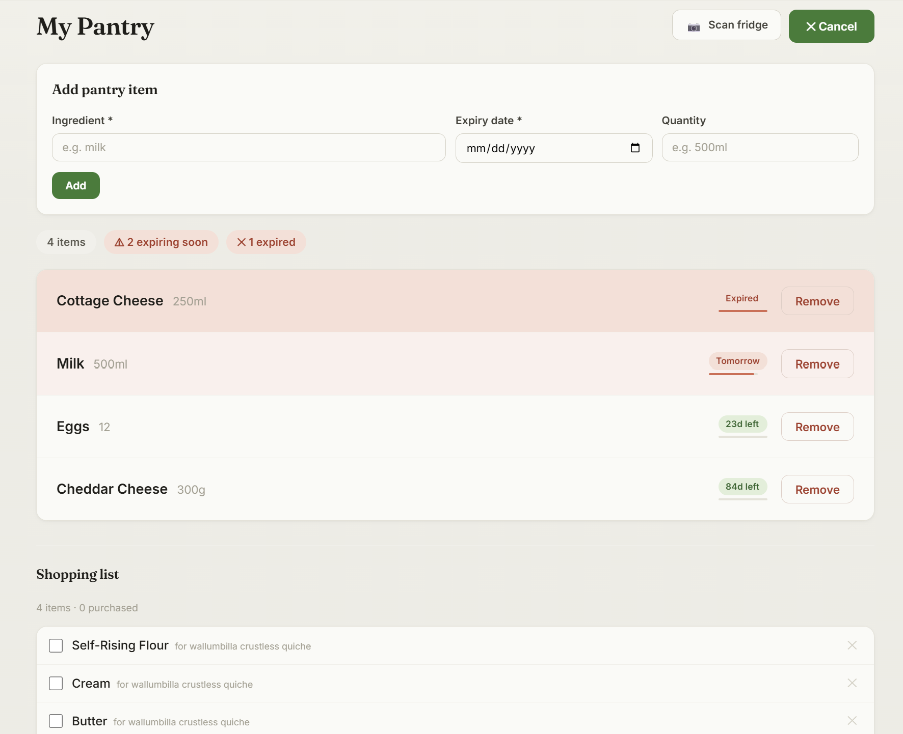
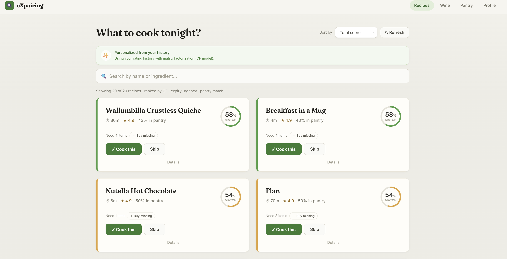
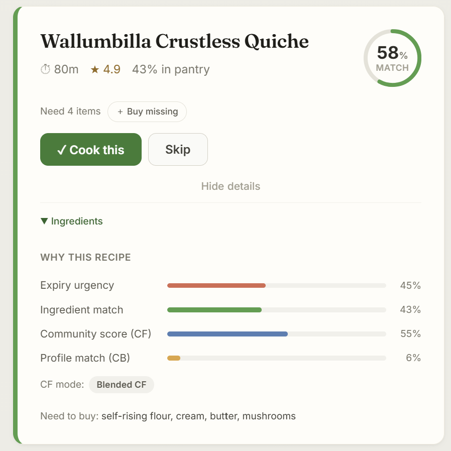

# eXpairing

eXpairing is a personalized recommendation platform built for the Recommender Systems Workshop at Tel Aviv University. It ranks recipes to minimize food waste by matching what is expiring in your fridge with your personal taste preferences, combined with a dedicated wine module for personalized wine suggestions and automated recipe-wine pairings.

&nbsp; 
## Live Application

eXpairing is deployed and running. So no clone, dataset download, or training run is required:

| | |
|---|---|
| **Web application** | **<https://eXpairing.onrender.com>** |
| API | <https://eXpairing-api.onrender.com> ([Swagger UI](https://eXpairing-api.onrender.com/docs)) |

The web application is hosted on a free instance and sleeps after roughly 15 minutes of inactivity, so the first page load after an idle period can take 30–60 seconds while it wakes. Recommendation requests take a few seconds to return: ranking is CPU-bound and the deployed instance is single-core.

To run the project locally instead, see the [Installation Guide](install.md).

&nbsp; 
## Documentation

You can find all the documentation in the following files:

- [Project Summary](summary.md)
- [Modules Description](modules.md)
- [Installation Guide](install.md)

&nbsp; 
## About

eXpairing operates as a smart dining assistant designed to solve a major household problem: pantries are full but hard to maintain. People buy ingredients, put them in the fridge, and forget they exist until they expire. Traditional recipe applications ask *"What do you feel like cooking today?"*, whereas **eXpairing flips this paradigm**, asking:  
> *"Given what is expiring in your fridge right now and how you actually cook, what is the highest-quality meal you will thoroughly enjoy?"*

It bridges the gap between **Personal Taste Preference** (what you love to eat) and **Real-World Household Feasibility** (what is expiring in your fridge). In addition, it integrates a full **Wine Recommender Module** to deliver personalized wine suggestions and automated recipe-wine pairing, providing a complete end-to-end culinary experience.

### Core Features
- **Smart Pantry & Photo Scanning**: Log ingredients by uploading a fridge photo (processed using GPT-4o or Gemini 2.5 Flash) or using autocomplete. Brand names and packaging noise (like "Tnuva 3% Milk") are automatically cleaned to match recipe ingredients ("milk").
- **Waste-Minimizing Recipe Feed**: Recipes are ranked using a hybrid scoring system that combines collaborative filtering (Biased Funk SVD / item-based cold start), ingredient expiry dates (exponential decay), ingredient match ratios, and content-based TF-IDF matching.
- **Revealed Preference Learning ($\beta$ Drift)**: Tracks actual cooking choices to adjust for user bias. If your stated waste-aversion preference ($\beta$) differs from your actual behavior (tracked via missing ingredients `n_missing` over time) by more than 10%, the system automatically updates the weights using an EMA feedback loop and shows a profile alert.
- **Feed Diversity (MMR)**: Uses Maximal Marginal Relevance (MMR, $\lambda=0.7$) based on ingredient Jaccard similarity to prevent showing too many similar recipes (e.g., multiple muffin variations) and ensure a diverse feed.
- **Cooking & Shopping Workflow**: Shows step-by-step recipes. You can add missing ingredients to a persistent shopping list with one click. Skipped recipes are hidden for 7 days.
- **Wine Recommender & Pairing**: Ranks wines based on confidence-weighted ALS collaborative filtering and sommelier vectors (`GET /wine/ranked`). Automatically matches wines to any recipe (`POST /wine/pair`) using 12-dimensional food category vectors and empirical pairing rules.

&nbsp; 

### Authors

- Roy Wind, Yoav Geva, Ben Carmel, Roei Shlein 
- Course Instructors: Dr. Rubi Boim, Stav Koren

&nbsp;

## Screenshots
Onboarding Page:

Pantry + Scan Fridge AI Vision + Shopping List Page:

Main Recipes Suggestions Page:

Recipes Card - Score Breakdown, Add to Shopping List:

Recipes Page - Full Steps + Matching of wine specific to recipe:

Wine Cold Start Page:

Wine Suggestions Page:

User Profile:

