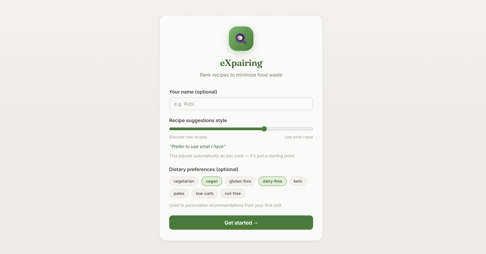
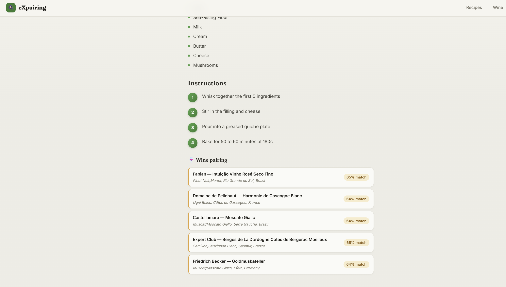
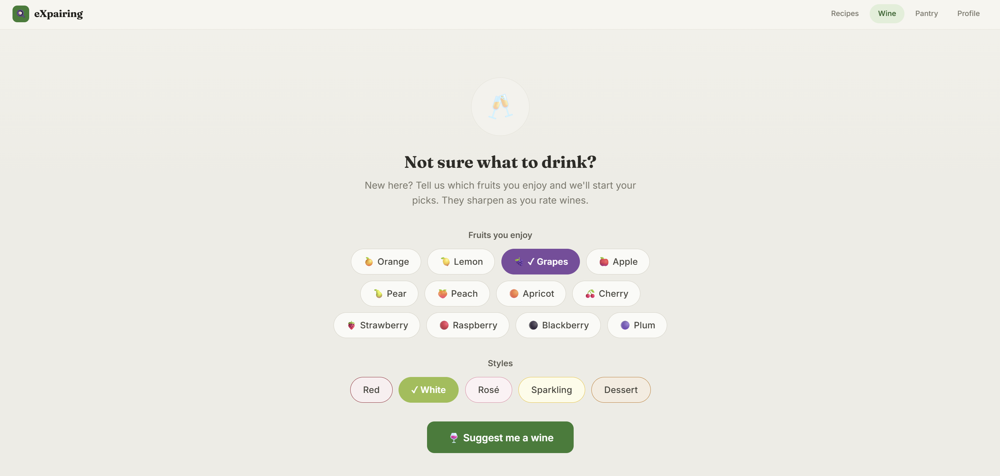
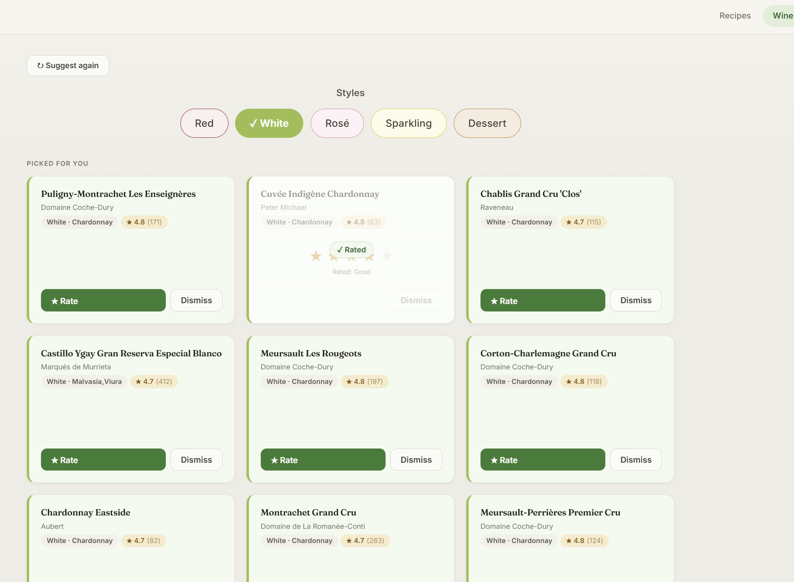
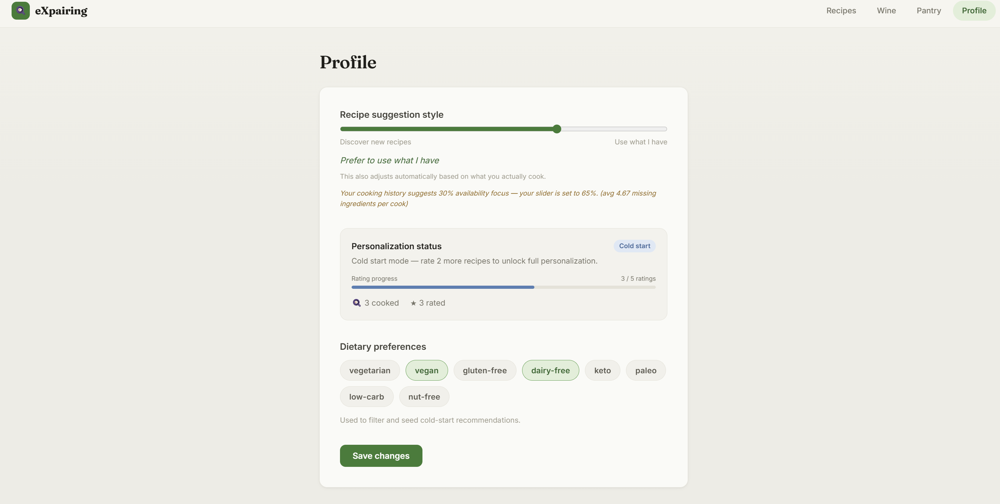

# eXpairing

eXpairing is a personalized recommendation platform built for the Recommender Systems Workshop at Tel Aviv University. It ranks recipes to minimize food waste by matching what is expiring in your fridge with your personal taste preferences, combined with a dedicated wine module for personalized wine suggestions and automated recipe-wine pairings.

&nbsp; 
## Live Application

eXpairing is deployed and running, so no clone, dataset download, or training run is required:

| | |
|---|---|
| **Web application** | **<https://eXpairing.onrender.com>** |
| API | <https://eXpairing-api.onrender.com> ([Swagger UI](https://eXpairing-api.onrender.com/docs)) |

The web application is hosted on a free instance and sleeps after roughly 15 minutes of inactivity, so the first page load after an idle period can take 30–60 seconds while it wakes. Recommendation requests take a few seconds to return: ranking is CPU-bound and the deployed instance is single-core. Both are expected behaviour, not faults.

To run the project locally instead, see the [Installation Guide](install.md).

&nbsp; 
## Documentation

You can find all the documentation in the following files:

- [Project Summary](summary.md)
- [Modules Description](modules.md)
- [Installation Guide](install.md)

&nbsp; 
## About

eXpairing operates as a smart dining assistant designed to solve a major household problem: pantries are full but hard to maintain. People buy ingredients, put them in the fridge, and forget they exist until they expire. Traditional recipe applications ask *"What do you feel like cooking today?"*, whereas **eXpairing flips this paradigm**, asking:  
> *"Given what is expiring in your fridge right now and how you actually cook, what is the highest-quality meal you will thoroughly enjoy?"*

It bridges the gap between **Personal Taste Preference** (what you love to eat) and **Real-World Household Feasibility** (what is expiring in your fridge). In addition, it integrates a full **Wine Recommender Module** to deliver personalized wine suggestions and automated recipe-wine pairing, providing a complete end-to-end culinary experience.

### Core Product Features & Value Propositions
- **Smart Pantry & Multi-Modal Vision Scanning**: Eliminates tedious manual tracking. Users can snap a fridge photo (processed via GPT-4o / Gemini 2.5 Flash) or use debounced autocomplete to log ingredients. Packaging noise and brand names ("Tnuva 3% Milk") are automatically canonicalized to model tokens ("milk").
- **Waste-Minimizing Recipe Feed**: Candidate recipes are ranked by a multi-component hybrid scoring engine blending Collaborative Filtering (Biased Funk SVD / item-based cold start), Expiry Urgency (exponential decay), Ingredient Match Ratios, and Content-Based TF-IDF matching.
- **Revealed Preference Learning (`β` Drift)**: Addresses aspirational user bias. While users set a stated waste-aversion preference ($\beta$), an EMA feedback loop tracks revealed cooking habits (`n_missing`). If a user's stated preference diverges from actual behavior by $>10\%$, the system adapts weights smoothly and alerts the user in their profile.
- **Feed Diversity & Monotony Reduction**: Applies Maximal Marginal Relevance (MMR $\lambda=0.7$) using ingredient Jaccard similarity. Prevents repetitive feeds (e.g. 20 variations of muffins) and surfaces diverse meal choices (pastas, soups, salads, bakes).
- **Interactive Cooking & Shopping Workflow**: Provides full numbered step-by-step instructions. Missing ingredients can be added with a single click to a persistent shopping list featuring deduplication, source recipe attribution, and store check-off flows. Skip exclusions suppress dismissed recipes for 7 days.
- **Personalized Wine & Automated Recipe Pairing**: Delivers tailored wine recommendations ("Suggest me a wine" via `GET /wine/ranked`) powered by confidence-weighted ALS collaborative filtering and structured sommelier vectors. Automatically pairs optimal wines with any recipe (`POST /wine/pair`) using 12-dimensional culinary category vector matching and empirical pairing rules.

&nbsp; 

### Authors

- Roy Wind, Yoav Geva, Ben Carmel, Roei Shlein 
- Course Instructors: Dr. Rubi Boim, Stav Koren

&nbsp;

## Screenshots
Onboarding Page:

Pantry + Scan Fridge AI Vision + Shopping List Page:

Main Recipes Suggestions Page:

Recipes Card - Score Breakdown, Add to Shopping List:

Recipes Page - Full Steps + Matching of wine specific to recipe:

Wine Cold Start Page:

Wine Suggestions Page:

User Profile:

